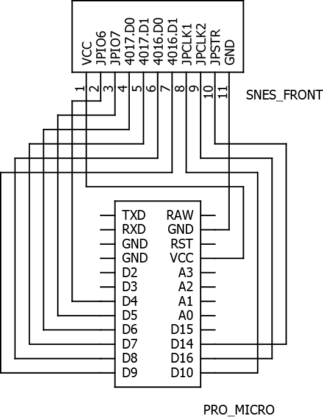

# SNES-HID

SNES-HID is SNES gamepad to USB converter.

## Features

- Works with Arduino based on the ATmega32u4 (Pro Micro recommended)
- Operates as USB HID device
- Two controllers are supported

## Schematic

## TODO

- SNES Mouse support
